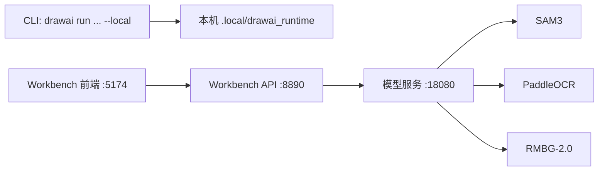

# DrawAI 运行方式与参数说明

这份文档专门放细节：端口、设备、模型目录、环境变量和常见部署组合。第一次使用建议先看根目录 [README](../../README.md)，跑通之后再回来看这里。

## 一张图看懂进程关系



最常见的三种形态：

- 🙂 单机 CLI：`drawai run ... --local` 直接在当前机器跑完整流程。
- 🧑‍💻 单机 Workbench：`drawai workbench` 同时拉起模型服务、API 和前端。
- 🖥️ 分离部署：`drawai server model` 在模型机器上跑，Workbench 或 API 通过 HTTP 连接它。

## 命令速查

| 目标 | 命令 |
| --- | --- |
| 准备并检查本地运行时 | `uv run drawai setup local` |
| 检查本地运行时 | `uv run drawai doctor local` |
| 单张图片本地运行 | `uv run drawai run <image> --local` |
| 启动完整 Workbench | `uv run drawai workbench` |
| 只启动模型服务 | `uv run drawai server model` |
| 只启动 Workbench API | `uv run drawai server api` |
| 前端连接已有 API | `uv run drawai workbench --api http://<api-host>:8890` |
| 配置文件全流程 | `uv run drawai run all --config configs/drawai/config.yaml` |

## 本地 setup

默认命令：

```bash
uv run drawai setup local
```

它会做四件事：

1. 下载模型文件到 `.local/drawai_runtime`
2. 创建 `.local/drawai_runtime/.venv`
3. 安装 DrawAI 本地运行时依赖
4. 自动执行一次 `uv run drawai doctor local`

常用参数：

| 参数 | 默认值 | 说明 |
| --- | --- | --- |
| `--runtime-root` | `.local/drawai_runtime` | 本地 runtime 目录 |
| `--source` | `modelscope` | 模型来源，可选 `modelscope` 或 `huggingface` |
| `--device` | `cpu` | 安装和运行设备配置，可选 `cpu`、`gpu`、`mps`、`auto` |
| `--python` | `3.12` | runtime venv 使用的 Python 版本 |
| `--download-only` | 关闭 | 只下载模型，不创建 venv |
| `--bootstrap-only` | 关闭 | 只创建或刷新 venv，不下载模型 |
| `--skip-doctor` | 关闭 | 完整 setup 后不自动执行 doctor |
| `--dry-run` | 关闭 | 只打印计划，不实际下载或安装 |

`--download-only`、`--bootstrap-only` 和 `--dry-run` 不会自动执行 doctor；这些分段命令完成后可以手动运行 `uv run drawai doctor local`。

doctor 会同时检查 `.local/drawai_runtime/.venv` 和当前 Workbench/API 所在的项目 Python 环境，避免出现 runtime 检查通过但 SVG 生成阶段缺少 Codex SDK 的情况。

Hugging Face 下载：

```bash
export HF_TOKEN=hf_...
uv run drawai setup local --source huggingface --accept-sam3-license
```

手动提供 SAM3：

```bash
uv run drawai setup local \
  --sam3-source /path/to/facebookresearch-sam3 \
  --sam3-checkpoint /path/to/sam3.pt \
  --sam3-bpe /path/to/bpe_simple_vocab_16e6.txt.gz
```

## 设备配置

| `--device` | SAM3 | RMBG | PaddleOCR | 适合场景 |
| --- | --- | --- | --- | --- |
| `cpu` | CPU | CPU | CPU | 默认、最稳、安装压力最低 |
| `gpu` | CUDA | CUDA | CPU | Linux + NVIDIA GPU |
| `mps` | CPU | MPS | CPU | Apple Silicon，本地轻量加速 |
| `auto` | 自动 | 自动 | CPU | 已经自己管理环境时使用 |

GPU setup 会根据 `nvidia-smi` 里的 CUDA runtime 版本选择 PyTorch wheel 后端。也可以手动指定：

```bash
uv run drawai setup local --device gpu --torch-backend cu126
uv run drawai setup local --device gpu --torch-backend cu128
uv run drawai setup local --device gpu --torch-backend cu130
```

如果你已经在 runtime venv 里装好了合适的 `torch` 和 `torchvision`：

```bash
uv run drawai setup local --skip-torch-install
```

## 模型文件路径

默认 runtime 目录结构：

```text
.local/drawai_runtime/
  .venv/
  source/
    sam3/
  models/
    sam3/
      sam3.pt
      bpe_simple_vocab_16e6.txt.gz
    paddlex/
      official_models/
        PP-OCRv5_server_det/
          inference.pdiparams
        PP-OCRv5_server_rec/
          inference.pdiparams
    rmbg2/
      model.safetensors
  tools/
```

这些文件默认不进入 git。换 runtime 目录时，setup、run、server 都要指向同一个 `--runtime-root`。

## 单图 CLI

最短命令：

```bash
uv run drawai run examples/demo_figure.png --local
```

常用参数：

| 参数 | 默认值 | 说明 |
| --- | --- | --- |
| `--local` | 必填 | 使用本地 in-process runtime |
| `--device` | `cpu` | `cpu`、`gpu`、`mps`、`auto` |
| `--run-name` | `local_single_svg_ppt` | 输出目录名字的一部分 |
| `--out` / `--run-root` | `runs` | 运行结果根目录 |
| `--runtime-root` | `.local/drawai_runtime` | 本地 runtime 目录 |
| `--base-config` | `configs/drawai/config.yaml` | 基础配置文件 |
| `--dry-run` | 关闭 | 只生成运行清单和配置，不实际跑模型 |

注意：这个单图快捷命令是本机 in-process 模式。如果要让 CLI 调远程模型服务，请使用配置文件分阶段运行，并把配置里的 SAM3、OCR、RMBG 地址改成远程模型服务地址。

## Workbench

完整本机 Workbench：

```bash
uv run drawai workbench
```

它会启动：

| 进程 | 默认地址 | 作用 |
| --- | --- | --- |
| 模型服务 | `http://127.0.0.1:18080` | SAM3、PaddleOCR、RMBG |
| Workbench API | `http://127.0.0.1:8890` | 任务、文件、流水线调度、Codex 调用 |
| 前端 | `http://127.0.0.1:5174` | 浏览器界面 |

启动器会优先用 `tmux` 管理这几个后台进程；如果系统没有安装 `tmux`，会自动降级为 `nohup`，日志仍然写到 `.local/drawai-local-services.log`、`.local/workbench-api.log` 和 `.local/workbench-frontend.log`。

局域网访问：

```bash
uv run drawai workbench --host 0.0.0.0
```

访问时不要写 `0.0.0.0`，要用服务器真实 IP：

```text
http://<server-ip>:5174/
```

前端连接已有 API：

```bash
uv run drawai workbench --api http://<api-host>:8890
```

Workbench 前端需要 Node.js 20.19+ 或 22.12+。首次启动时脚本会在 `apps/workbench` 里自动执行 `npm ci` 或 `npm install`。

## 模型服务

启动全部模型：

```bash
uv run drawai server model --host 0.0.0.0
```

只启动某几个模型：

```bash
uv run drawai server model sam3 rmbg --host 0.0.0.0
uv run drawai server model ocr --host 0.0.0.0
```

常用参数：

| 参数 | 默认值 | 说明 |
| --- | --- | --- |
| `--host` | `127.0.0.1` | 监听地址 |
| `--sam-port` | `18080` | SAM3 和 RMBG 默认端口 |
| `--ocr-port` | `18080` | OCR 默认端口，默认和 SAM3 共用 |
| `--runtime-root` | `.local/drawai_runtime` | runtime 目录 |
| `--device` | `cpu` | 统一设备配置 |
| `--sam3-device` | 由 `--device` 推导 | 单独覆盖 SAM3 设备 |
| `--rmbg-device` | 由 `--device` 推导 | 单独覆盖 RMBG 设备 |
| `--paddle-device` | `cpu` | 单独覆盖 PaddleOCR 设备 |

健康检查：

```bash
curl http://127.0.0.1:18080/health
```

推荐使用统一入口：

```bash
uv run drawai server model
```

`drawai-local-services` 这个 console script 仍然保留，但开源文档和新部署建议统一走 `drawai server model`。

## Workbench API

API 连接已有模型服务：

```bash
uv run drawai server api \
  --host 0.0.0.0 \
  --model-api http://<model-host>:18080
```

常用参数：

| 参数 | 默认值 | 说明 |
| --- | --- | --- |
| `--host` | `127.0.0.1` | API 监听地址 |
| `--port` | `8890` | API 端口 |
| `--workspace` | `.local/workbench` | Workbench 数据目录 |
| `--config` | `configs/drawai/config.yaml` | 默认流水线配置 |
| `--model-api` | 空 | 统一模型服务地址 |
| `--sam3-api` | 空 | 单独指定 SAM3 地址 |
| `--ocr-api` | 空 | 单独指定 OCR 地址 |
| `--rmbg-api` | 空 | 单独指定 RMBG 地址 |
| `--no-start-model` | 关闭 | 不自动启动本地模型子进程 |
| `--runtime-root` | `.local/drawai_runtime` | 自动启动本地模型时使用 |
| `--device` | `cpu` | 自动启动本地模型时使用 |

如果 `--model-api`、`--sam3-api`、`--ocr-api`、`--rmbg-api` 都没有提供，API 会尝试自动启动本地模型服务。

## 配置文件分阶段运行

全流程：

```bash
uv run drawai run all --config configs/drawai/config.yaml
```

阶段列表：

| 阶段 | 作用 |
| --- | --- |
| `prepare` | 归一化输入图片 |
| `detect_structure` | SAM3 结构检测 |
| `detect_text` | OCR 文本检测 |
| `assemble_boxir` | 合并结构和文本成 BoxIR |
| `asset_plan` | 决定哪些元素转 SVG、裁图或去背景 |
| `asset_analyze` | Codex 分析元素和素材 |
| `asset_materialize` | 按已调整/确认的方案生成裁图和去背景素材 |
| `svg` | 生成、渲染、验证 SVG |
| `export` | 导出 PPTX 烟测结果 |

只跑一个阶段：

```bash
uv run drawai run detect_text --config configs/drawai/config.yaml
```

从已有产物继续：

```bash
uv run drawai \
  --config configs/drawai/config.yaml \
  --from-stage assets_materialized \
  --to-stage svg_generated
```

## 常用环境变量

| 环境变量 | 对应含义 |
| --- | --- |
| `DRAWAI_LOCAL_RUNTIME_ROOT` | 默认 runtime 目录 |
| `DRAWAI_MODEL_SOURCE` | `modelscope` 或 `huggingface` |
| `DRAWAI_DEVICE` | 默认设备配置 |
| `DRAWAI_TORCH_BACKEND` | Torch wheel 后端 |
| `DRAWAI_TORCH_INDEX_URL` | Torch 安装源 |
| `DRAWAI_MODEL_API` | Workbench 使用的统一模型服务地址 |
| `DRAWAI_SAM3_BASE_URL` | SAM3 服务地址 |
| `DRAWAI_OCR_BASE_URL` | OCR 服务地址 |
| `DRAWAI_RMBG_BASE_URL` | RMBG 服务地址 |
| `DRAWAI_WORKBENCH_HOST` | Workbench 监听地址 |
| `DRAWAI_WORKBENCH_FRONTEND_PORT` | 前端端口 |
| `DRAWAI_WORKBENCH_API_PORT` | Workbench API 端口 |
| `DRAWAI_WORKBENCH_WORKSPACE` | Workbench 数据目录 |
| `DRAWAI_CODEX_INHERIT_HOST_CONFIG` | 设为 `1` 时，受控 Codex 子进程继承 host Codex `config.toml` 里的模型 provider/base_url/model 配置 |
| `DRAWAI_CODEX_MODEL` | 覆盖继承到受控 Codex 子进程的模型名，例如 CCswitch 中可用的 `gpt-5.5` |
| `OPENAI_API_KEY` | Codex/OpenAI 认证方式之一 |
| `HF_TOKEN` | Hugging Face 下载 gated repo 时使用 |

## 常见部署组合

### 本机 CPU 试跑

```bash
uv run drawai setup local
uv run drawai run examples/demo_figure.png --local
```

### Linux GPU 服务器跑 Workbench

```bash
uv run drawai setup local --device gpu
uv run drawai workbench --host 0.0.0.0 --device gpu
```

浏览器访问：

```text
http://<server-ip>:5174/
```

### GPU 机器只跑模型，另一台机器跑 Workbench

```bash
# GPU 机器
uv run drawai setup local --device gpu
uv run drawai server model --host 0.0.0.0 --device gpu
```

```bash
# Workbench 机器
uv run drawai workbench --model-api http://<gpu-machine-ip>:18080
```

### 已有 API，只启动前端

```bash
uv run drawai workbench --api http://<api-host>:8890 --host 0.0.0.0
```

### 只验证配置和输出目录

```bash
uv run drawai run examples/demo_figure.png --local --dry-run
```

## 排错提示

- `drawai: command not found`：使用 `uv run drawai ...`，不要直接运行全局 `drawai`。
- `vite: 没有那个文件或目录`：重新运行 `uv run drawai workbench`，脚本会安装前端依赖；同时确认 Node.js 版本满足要求。
- 局域网访问失败：服务端用 `--host 0.0.0.0`，客户端用服务器真实 IP，不要用 `127.0.0.1` 或 `0.0.0.0`。
- 模型服务连不上：先在服务所在机器运行 `curl http://127.0.0.1:18080/health`，再从客户端机器访问 `curl http://<server-ip>:18080/health`。
- GPU 没生效：确认 setup 时用了 `--device gpu`，并检查 `nvidia-smi` 和 `uv run drawai doctor local`。
- Codex 认证失败：设置 `OPENAI_API_KEY`，或先完成 Codex 登录，再运行 `uv run drawai doctor local`。如果 Codex 通过 CCswitch 等本地 provider 代理运行，可设置 `DRAWAI_CODEX_INHERIT_HOST_CONFIG=1` 让 DrawAI 的受控 Codex 子进程继承 host Codex provider 配置；如果继承到的模型不可用，再用 `DRAWAI_CODEX_MODEL` 指定可用模型。

## 协议提醒

DrawAI 源码是 Apache-2.0。模型和权重不是同一个协议面：

- SAM3：Meta SAM License / 上游仓库条款
- RMBG-2.0：BRIA 访问和使用条款，默认需要注意非商业限制
- PaddleOCR：PaddleOCR 和对应模型仓库条款

如果要公开发布、公司内部部署或商用，建议把模型协议作为发布检查项单独确认。
